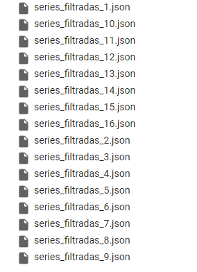

# Código realizado durante o programa de bolsas da CompassUol 

## Para a utilização siga esse passo a passo:
- [x] Abra o código dentro do colab
- [x] Busque no código a primeira função **def main()**
- [x] Nela você vai encontrar a variavel **api_key** onde você vai colocar a sua API do TMDB
- [x] Logo após fazer isso, mude também dentro da **def main()** a variavel total_paginas para o valor que você quiser que faça a busca
- [x] Feito isso, pode executar a cédula onde está o **if __name__ == '__main__':** 
- [x] Logo após o término da execução, será salvo em .json os arquivos extraidos da API como mostra na imagem abaixo 
 
- [x] Com os arquivos .json gerados, siga para o próximo passo
- [x] Dentro da função **def carregar_series_from_json():** localize a primeira estrutura de repetição
- [x] Mude o valor que está dentro do range de acordo com a quantia de arquivos .json gerados  
      - Se gerou 10 arquivos, coloque o valor 10.
- [x] Pode acessar a última cédula e executar ela
- [x] Digite o nome da série que você gosta para ele fazer as recomendações
- [x] Caso deseja continuar colocando mais séries que você gosta, basta seguir o looping, caso contrario é apenas quebrar digitando qualquer tecla ao invés da tecla **S**
- [X] Também tem como você salvar todos os resultados gerados antes, caso queira basta digitar **S**

## Lógica por trás do código 
1. Requisição da API
  - São importadas as bibliotecas requests, json e math
  - O código se tem várias funções, a explicação de cada uma:
     - A função **obter_mapa_id_para_nome_genero** faz um mapeamento dos IDS dos gêneros para buscar seus nomes
     - A função **obter_detalhes_serie** obtem todos os detalhes de uma série com base no ID dela pela requisição À API.
     - A função **filtrar_series** recebe todos os detalhes obtidas utilizando os generos desejados como parametro
     - A função **salvar_lote_series** recebe todos os resultados obtidos anteriormente e salva ele em lotes separados por 100 em arquivos JSON
     - A função **obter_resposta_api** é chamada para obter os dados da API com base na URL
     - A função **main** é a principal, já que é lá onde você coloca a sua chave API e a URL da API para obter os resultados esperados
  - A seguir o código roda dessa maneira
    -  A variavel **todos_resultados** é inicializada com os resultados da primeira página
      - Em seguida o código fica dando looping conforme a variavel **total_paginas** definida pelo usúario
        - Dentro do loop, a URL é atualizada para a página atual e a função **obter_resposta_api** é chamada para obter os dados da página
        - Conforme já dito, os resultados ficam salvos dentro de **todos_resultados**
          - Após sair do Loop, a lista **generos_desejados** é definida com os ID's dos gêneros filtrados
            - A função **filtrar_series** é chamada passando a chave API, os resultados de todas as séries e os gêneros desejados como argumeentos
              - Ela retorna uma lista de séries filtradas com base nos generos
            - Em seguida o código inicia um loop para percorrer cada lote de séries
            - O código divide a lista de séries filtradas em lotes de acordo com o tamho do lote definido do usuario
            - A função **salvar_lote_series** é chamada para salvar cada lote de séries em um arquivo JSON
            - O loop continua até que todos os lotes de séries tenham sidos salvos
              
2. Recomendação de série
  - São importadas as bibliotecas pandas, scikit-learn (cosine_similarity), gensim (Word2vec) e random.
  - A explicação das funções:
    - **carregar_series_from_json** como já diz o nome, é resposnsavel por carregar os dados dos arquivos JSON particionados e adicionados a uma lista **series**
    - **preprocessar_dados** recebe a lista de séries e cria um DataFrame chamado **df_series** com base na lista.
      - Se a coluna **nome_original** do arquivo json estiver presente no DataFrame é criado uma nova coluna chamada **nome_preprocessados** que contém o nome original preprocessado usando a função **simple_preprocess**
    - **treinar_modelo** recebe o DataFrame e treina um modelo de Word2Vec com base nos nomes processados das séries
    - **recomendar_serie** recebe o nome de uma série, o DataFrame **df_series** e o modelo treinado
      - Preprocessa o nome da série fornecido, calcula o vetor de embedding para o nome e em seguida calculca a similaridade entre esse vetor e os vetores de embeddind das séries presentes no DataFrame
      - Conforme for mais similar, ela retorna um DataFrame com as séries mais parecidas que tem as colunas nome_original, generos e popularidade como resultado
    - **salvar_series** recebe uma lista de recomendação e salva cada uma em um arquivo separado
    - **main** é a principal, ela executa todas as etapas como carregar os dados, processar os dados, treinar o modelo e fazer as recomendações
    - Dentro do loop principal, quem executa o código é pedido a digitar uma série para o algoritmo conseguir fazer as recomendações
      - Caso ele queira continuar, basta digitar a tecla S
      - Caso não, só apertar qualquer tecla
      - Também é dado como opçao salvar os resultados em um arquivo TXT depois da saida do Loop principal
      - Se tem a mesma lógica, caso queira digite S ou se não qualquer tecla para encerrar o programa.

